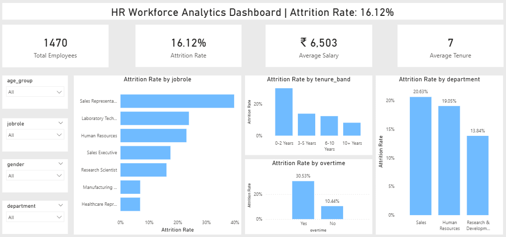

# 📊 HR Workforce Analytics & Attrition Intelligence Dashboard

## 📌 Project Overview
This project analyzes employee attrition patterns using Python, MySQL, Excel, and Power BI.  
The objective is to identify key drivers of workforce turnover and generate actionable business insights.

---

## 🧠 Business Problem
The organization is experiencing a **16.12% attrition rate**.  
Management wants to understand:

- Which departments have the highest attrition?
- Which job roles are most at risk?
- Does overtime significantly impact retention?
- Are early-tenure employees more likely to leave?
- Does salary influence attrition?

---

## 🛠 Tools & Technologies
- **Python** (Pandas, NumPy, Matplotlib, Seaborn)
- **MySQL** (Database Design, CTEs, Window Functions)
- **Excel** (Pivot Tables, KPI Dashboard)
- **Power BI** (DAX, Interactive Dashboard)

---

## 📊 Key Insights
- Overall Attrition Rate: **16.12%**
- Sales department shows highest attrition (~20.63%)
- Sales Representatives show highest risk (~40%)
- Employees working overtime are ~3x more likely to leave
- Attrition is highest within first 2 years of employment
- Lower income group employees show higher attrition

---

## 📈 Dashboard Preview

---

## 🔄 Project Workflow
1. Data Cleaning & Feature Engineering (Python)
2. Database Creation & Business Query Analysis (MySQL)
3. Operational Reporting (Excel)
4. Executive Dashboard Design (Power BI)
5. Insight Extraction & Business Recommendations

---

## 🎯 Business Recommendations
- Improve early-stage employee engagement (0–2 years focus)
- Review compensation strategy for Sales Representatives
- Reduce overtime workload
- Implement retention programs in Sales department
